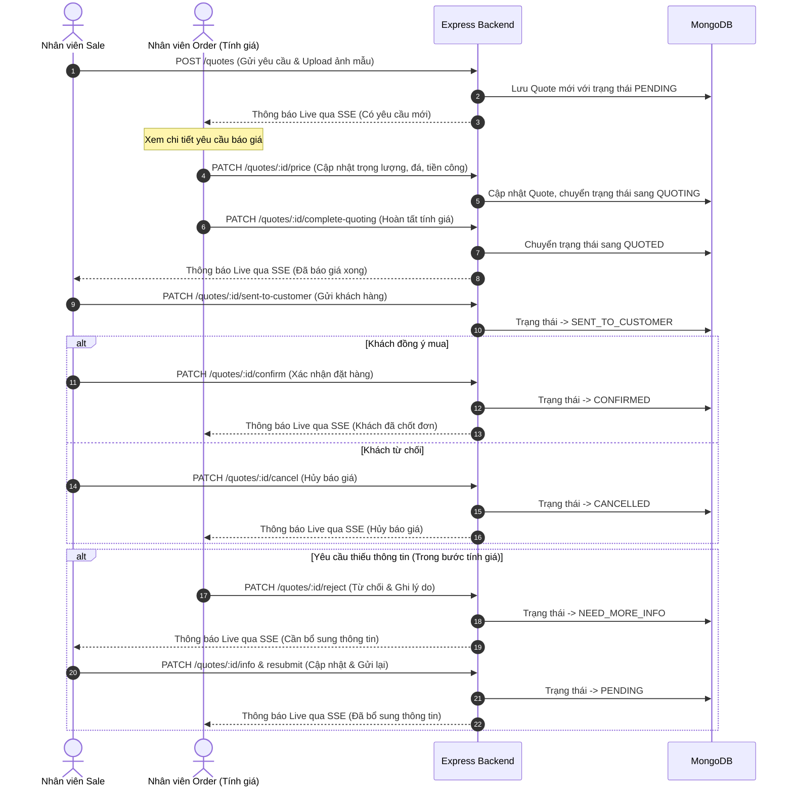

# VCB Jewelry Pricing Tool Backend (Express.js Version)

Phiên bản Backend được viết lại bằng **Express.js (TypeScript)** từ NestJS, tối ưu hóa cấu trúc thư mục chuẩn của Express, giữ nguyên vẹn logic nghiệp vụ, cơ chế xác thực/validate dữ liệu, lưu trữ file và hệ thống thông báo thời gian thực Server-Sent Events (SSE).

---

## 📂 Cấu trúc Thư mục dự án (Express.js Structure)

Dự án được tổ chức theo kiến trúc phân lớp sạch sẽ (Clean Architecture) của Express.js:

```text
Jewelry-Pricing-Tool-BE-2/
├── uploads/                    # Thư mục chứa ảnh tải lên (quotes, production)
├── src/
│   ├── config/                 # Cấu hình hệ thống & Kết nối Database
│   │   └── db.ts               # Kết nối MongoDB và tự động seed PricingConfig
│   ├── controllers/            # Bộ điều khiển (Xử lý HTTP Request/Response)
│   │   ├── pricingConfig.controller.ts
│   │   ├── production.controller.ts
│   │   ├── quotes.controller.ts
│   │   └── notifications.controller.ts
│   ├── routes/                 # Định tuyến các API endpoints
│   │   ├── index.ts            # Gom tất cả các router
│   │   ├── pricingConfig.routes.ts
│   │   ├── production.routes.ts
│   │   ├── quotes.routes.ts
│   │   └── notifications.routes.ts
│   ├── models/                 # Mongoose Models (Schemas & Interfaces)
│   │   ├── GoldPrice.ts
│   │   ├── MaterialRatio.ts
│   │   ├── PricingConfig.ts
│   │   ├── Production.ts
│   │   ├── QuotationHistory.ts
│   │   ├── Quote.ts
│   │   └── StonePrice.ts
│   ├── services/               # Chứa logic nghiệp vụ cốt lõi (Business Logic)
│   │   ├── pricingConfig.service.ts
│   │   ├── production.service.ts
│   │   ├── quotes.service.ts
│   │   └── notifications.service.ts
│   ├── middleware/             # Các bộ lọc Middleware
│   │   └── upload.middleware.ts       # Upload file bằng Multer
│   ├── app.ts                  # Cấu hình Express App (CORS, JSON parser, Static, Error Handler)
│   ├── server.ts               # Entry Point chính (Khởi chạy kết nối DB và listen port)
│   └── seed.ts                 # Script độc lập khởi tạo dữ liệu ban đầu
├── package.json
├── tsconfig.json
├── nodemon.json
└── .env
```

---

## 🔄 Các Luồng Nghiệp Vụ Chính (Application Flows)

### 1. Luồng Báo giá Trang sức (Jewelry Quote Flow)

Luồng xử lý từ khi Sale tạo yêu cầu báo giá đến khi hoàn thành hoặc đưa vào sản xuất:



### 2. Luồng Gia công / Sản xuất (Production Flow)

Sau khi khách hàng chốt đơn, quy trình sản xuất được thực hiện:

1. **Khởi tạo đơn gia công**: Nhân viên Order tạo đơn gia công từ Quote đã xác nhận (`POST /production`). Trạng thái của Quote chuyển sang `IN_PRODUCTION`, đơn sản xuất được lưu dưới dạng `PENDING_PRODUCTION`.
2. **Cập nhật tiến độ**: Đơn hàng lần lượt đi qua các công đoạn gia công (`PATCH /production/:id/progress`):
   * `PENDING_PRODUCTION` (Chờ gia công)
   * `CASTING` (Lấy sáp / Đúc phôi vàng)
   * `SETTING_STONES` (Vào đá / Gắn hột)
   * `POLISHING` (Đánh bóng / Xi mạ)
   * `QUALITY_CHECK` (Kiểm định chất lượng sản phẩm)
3. **Hoàn thành đơn gia công**: Upload ảnh thành phẩm và hoàn tất (`PATCH /production/:id/complete`), trạng thái chuyển sang `COMPLETED`.

### 3. Luồng Thông báo Thời gian thực (SSE Notifications Flow)

* **Kết nối**: Frontend mở kết nối qua EventSource tới API `GET /notifications/stream?role=sale` (hoặc `role=order`).
* **Hoạt động**: Backend lưu giữ các kết nối đang mở và sử dụng RxJS `Subject` hoạt động như một Event Bus.
* **Gửi sự kiện**: Khi các trạng thái của Quote thay đổi, hệ thống kích hoạt hàm `emit` trong `NotificationsService`. Backend tự động lọc và đẩy dữ liệu JSON tương thích về đúng các Client tương ứng với Role của họ.

---

## 🛠️ Hướng dẫn Cài đặt & Khởi chạy

### 1. Chuẩn bị môi trường
* Đảm bảo máy tính đã cài đặt **Node.js** (Khuyên dùng v18+) và **MongoDB** đang chạy trên môi trường local (hoặc sử dụng URI MongoDB Atlas).

### 2. Cài đặt Dependencies
Di chuyển vào thư mục dự án mới và cài đặt các gói cần thiết:
```bash
cd Jewelry-Pricing-Tool-BE-2
npm install
```

### 3. Cấu hình biến môi trường
Tạo tệp `.env` dựa theo file `.env.example` và thiết lập các thông số kết nối:
```env
MONGODB_URI=mongodb://localhost:27017/Jewelry-Pricing-Tool
PORT=3000
FE_URL=http://localhost:3001
```

### 4. Khởi tạo cơ sở dữ liệu (Seed Data)
Chạy script seed để tạo các bảng dữ liệu mẫu cấu hình giá vàng, tỷ lệ vàng, bảng giá đá ban đầu:
```bash
npm run seed
```

### 5. Chạy Backend
* **Chế độ phát triển (Development watch)**:
  ```bash
  npm run dev
  ```
  *(Dự án sẽ tự động reload lại khi bạn chỉnh sửa code bằng nodemon)*

* **Biên dịch và chạy Production**:
  ```bash
  npm run build
  npm start
  ```
