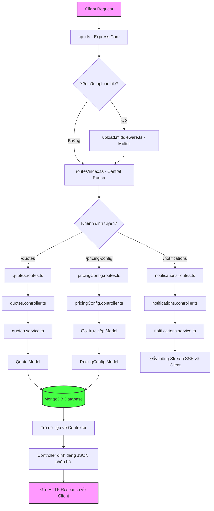

# 💍 VCB Jewelry Pricing Tool – Backend (Express.js Version)

Tài liệu này cung cấp cái nhìn chi tiết và toàn diện về cấu trúc thư mục, kiến trúc phân lớp, vòng đời yêu cầu (Request Lifecycle), luồng dữ liệu nghiệp vụ (Business Data Flows), và chức năng cụ thể của từng tệp tin trong hệ thống Backend Express.js.

---

## 🗺️ Tổng quan Kiến trúc & Sơ đồ File

Dự án được xây dựng dựa trên nền tảng **Express.js (TypeScript)** theo kiến trúc phân lớp hướng dịch vụ (Service-Layered Architecture). Mô hình này chia tách rõ rệt giữa Định tuyến (Routes), Điều phối (Controllers), Xử lý nghiệp vụ (Services) và Quản lý dữ liệu (Models).

### 📂 Bản đồ thư mục & Chức năng của từng file

```text
Jewelry-Pricing-Tool-BE-2/
├── uploads/                            # Thư mục lưu trữ tệp tải lên tĩnh (ảnh sản phẩm)
│   └── quotes/                         # Ảnh thiết kế mẫu đính kèm yêu cầu báo giá
├── src/
│   ├── config/                         # Cấu hình môi trường & kết nối tài nguyên ngoại vi
│   │   └── db.ts                       # Khởi tạo kết nối MongoDB, chèn dữ liệu PricingConfig mặc định
│   ├── models/                         # Lớp dữ liệu (Mongoose Schemas & Interfaces)
│   │   ├── GoldPrice.ts                # Lịch sử giá vàng 24K nguyên liệu (VND/chỉ và VND/gram)
│   │   ├── MaterialRatio.ts            # Tỉ lệ hàm lượng vàng/tuổi vàng (10K, 14K, 18K, 24K, 610)
│   │   ├── PricingConfig.ts            # Cấu hình cấu trúc giá: tỷ lệ vàng, biên lợi nhuận, hệ số bạc
│   │   ├── QuotationHistory.ts         # Nhật ký ghi nhận lịch sử thay đổi trạng thái báo giá
│   │   └── Quote.ts                    # Thực thể Yêu cầu Báo giá của khách hàng
│   │   └── StonePrice.ts               # Bảng giá chi tiết từng chủng loại đá quý và phụ kiện
│   ├── middleware/                     # Các bộ lọc trung gian xử lý Request
│   │   └── upload.middleware.ts        # Cấu hình lưu trữ, giới hạn dung lượng & số lượng tệp tải lên (Multer)
│   ├── routes/                         # Lớp định tuyến API Endpoints
│   │   ├── index.ts                    # Điểm gom trung tâm, điều phối các nhánh API con
│   │   ├── pricingConfig.routes.ts     # Định tuyến API quản lý cấu hình giá
│   │   ├── quotes.routes.ts            # Định tuyến API quản lý yêu cầu báo giá
│   │   └── notifications.routes.ts     # Định tuyến API stream thông báo SSE thời gian thực
│   ├── controllers/                    # Lớp điều phối HTTP Request/Response
│   │   ├── pricingConfig.controller.ts # Tiếp nhận yêu cầu đọc/ghi cấu hình định giá
│   │   ├── quotes.controller.ts        # Tiếp nhận, phản hồi các trạng thái của yêu cầu báo giá
│   │   └── notifications.controller.ts # Tiếp nhận client đăng ký SSE, quản lý kết nối và đẩy luồng sự kiện
│   ├── services/                       # Lớp chứa Logic nghiệp vụ lõi (Business Logic)
│   │   ├── pricingConfig.service.ts    # Nghiệp vụ đọc/cập nhật cấu hình định giá
│   │   ├── quotes.service.ts           # Nghiệp vụ tạo mã báo giá, cập nhật thông tin và chuyển đổi trạng thái
│   │   └── notifications.service.ts    # Quản lý Event Bus (RxJS Subject), đẩy thông báo thời gian thực theo phân quyền vai trò
│   ├── app.ts                          # Khởi tạo và thiết lập Express App (CORS, JSON Parser, Static folder, Error Handler)
│   ├── server.ts                       # Entry Point của ứng dụng (Khởi động Server, lắng nghe cổng kết nối)
│   └── seed.ts                         # Script độc lập chèn dữ liệu mẫu ban đầu vào Database
├── tsconfig.json                       # Cấu hình trình biên dịch TypeScript
├── nodemon.json                        # Cấu hình reload code tự động khi code thay đổi ở môi trường Dev
├── package.json                        # Khai báo dependencies và các câu lệnh thực thi npm scripts
└── .env                                # Chứa cấu hình biến môi trường cục bộ (Database URI, Ports, URLs)
```

---

## ⚡ Vòng đời của một Request (Request Lifecycle)

Mỗi khi có một yêu cầu HTTP gửi từ Frontend Next.js tới Backend Express, dữ liệu sẽ di chuyển qua các bước tuần tự như sau:



1. **Khởi đầu (Express Core)**: `app.ts` nhận Request, cấu hình CORS (cho phép Next.js tại cổng 3001 gọi tới), parse định dạng JSON và URL-encoded.
2. **Bộ lọc Tải tệp (Multer Middleware)**: Nếu Endpoint yêu cầu tải hình ảnh lên (như `POST /quotes`), middleware `upload.middleware.ts` sẽ can thiệp trước để ghi file vào đĩa cứng (`uploads/quotes`) và gán mảng tệp vào `req.files`.
3. **Phân luồng (Routes)**: `routes/index.ts` điều phối request về router thích hợp.
4. **Tiếp nhận & Kiểm tra (Controller)**: Controller tương ứng bóc tách tham số từ `req.body`, `req.query`, `req.params` hoặc tệp hình ảnh từ Multer, sau đó chuyển giao sang lớp Service.
5. **Logic nghiệp vụ (Service)**: Service thực hiện các nghiệp vụ tính toán, cập nhật trạng thái liên quan và tương tác với Database.
6. **Truy xuất dữ liệu (Models)**: Mongoose Models thực thi các truy vấn đọc/ghi xuống MongoDB.
7. **Phát sự kiện (SSE Event Bus)**: Nếu tác vụ làm thay đổi trạng thái quan trọng (ví dụ: hoàn thành báo giá, yêu cầu bị trả lại, khách đặt hàng...), Service sẽ gọi `notificationsService` để phát sự kiện thời gian thực tới người dùng.
8. **Phản hồi (HTTP Response)**: Controller nhận dữ liệu trả về từ Service và gửi response dạng JSON về client kèm mã trạng thái phù hợp (200, 201, 404, 500...).

---

## 🔄 Chi tiết các Luồng Dữ liệu Nghiệp vụ (Business Data Flows)

### 1. Luồng Báo giá Trang sức (Quotation Workflow)
Luồng này điều khiển vòng đời trạng thái của báo giá từ lúc tạo đến lúc đặt hàng thành công hoặc bị hủy.

```text
  [PENDING] (Sale tạo mới) ──> [QUOTING] (Order bấm tính giá) ──> [QUOTED] (Tính giá xong)
      │ ▲                                                               │
      │ │ (Sale sửa thông tin và gửi lại)                               │
      ▼ │                                                               ▼
[NEED_MORE_INFO] <────────────────────────────────────────── [SENT_TO_CUSTOMER] (Sale gửi khách)
  (Order từ chối)                                                       │
                                                           ┌────────────┴────────────┐
                                                           ▼                         ▼
                                                     [CONFIRMED]                [CANCELLED]
                                                 (Khách đồng ý mua)           (Khách từ chối)
```

- **Tạo báo giá (`POST /quotes`)**:
  - Xử lý tại: [quotes.controller.ts](file:///c:/Jewelry-Pricing-Tool/Jewelry-Pricing-Tool-BE-2/src/controllers/quotes.controller.ts#L34-L43) và [quotes.service.ts](file:///c:/Jewelry-Pricing-Tool/Jewelry-Pricing-Tool-BE-2/src/services/quotes.service.ts#L20-L32).
  - Tự động tạo mã định danh duy nhất có cấu trúc: `QT-YYYY-xxxx` (Ví dụ: `QT-2026-0001`).
  - Lưu trạng thái ban đầu là `PENDING`.
  - Kích hoạt sự kiện SSE gửi đến tài khoản thuộc vai trò `order` để thông báo có yêu cầu báo giá mới cần xử lý.
- **Từ chối / Yêu cầu thêm thông tin (`PATCH /quotes/:id/reject`)**:
  - Xử lý tại: [quotes.controller.ts](file:///c:/Jewelry-Pricing-Tool/Jewelry-Pricing-Tool-BE-2/src/controllers/quotes.controller.ts#L63-L71) và [quotes.service.ts](file:///c:/Jewelry-Pricing-Tool/Jewelry-Pricing-Tool-BE-2/src/services/quotes.service.ts#L52-L70).
  - Trạng thái chuyển sang `NEED_MORE_INFO`, ghi nhận lý do từ chối vào cơ sở dữ liệu (`rejectReason`).
  - Gửi thông báo SSE trực tiếp tới tài khoản thuộc vai trò `sale` để thông báo cần bổ sung thông tin.
- **Sale chỉnh sửa & Gửi lại (`PATCH /quotes/:id/info` và `PATCH /quotes/:id/resubmit`)**:
  - Xử lý tại: [quotes.controller.ts](file:///c:/Jewelry-Pricing-Tool/Jewelry-Pricing-Tool-BE-2/src/controllers/quotes.controller.ts#L73-L98) và [quotes.service.ts](file:///c:/Jewelry-Pricing-Tool/Jewelry-Pricing-Tool-BE-2/src/services/quotes.service.ts#L72-L103).
  - Cho phép cập nhật thông tin mô tả, kích thước, danh sách đá yêu cầu và thay thế/bổ sung hình ảnh thiết kế.
  - Sau khi chỉnh sửa xong, lệnh `resubmit` chuyển đổi trạng thái về lại `PENDING` và gửi SSE báo cho vai trò `order`.

---

### 2. Luồng Cấu hình & Logic Tính toán Giá bán (Pricing & Formulas)

> [!IMPORTANT]
> **Quy tắc phân tách logic**: Để giảm tải xử lý cho Backend và hỗ trợ hiển thị giá thay đổi tức thì trên màn hình tính toán (Real-time Interactive Calculator), **toàn bộ các công thức toán học định giá được thực thi trực tiếp trên Frontend (Next.js)**. 

Tuy nhiên, Frontend **không tự ý lưu trữ cấu hình cứng (hardcode)**. Thay vào đó, luồng dữ liệu cấu hình định giá hoạt động như sau:

```
┌────────────────────────────────┐                 HTTP GET /pricing-config
│   MongoDB Database             ├─────────────────────────────────────────┐
│   (Bảng pricing_config)        │                                         │
└──────────────▲─────────────────┘                                         ▼
               │                                            ┌─────────────────────────────┐
               │  HTTP PUT /pricing-config                  │   Frontend Next.js          │
               └────────────────────────────────────────────┤   (Thực hiện tính toán)     │
                   (Admin cập nhật cấu hình mới)            └──────────────┬──────────────┘
                                                                           │
                                                                           │  Gửi kết quả định giá
                                                                           │  (materialCost, sellingPrice...)
                                                                           ▼
                                                            ┌─────────────────────────────┐
                                                            │   MongoDB Database          │
                                                            │   (Bảng quotes cập nhật)    │
                                                            └─────────────────────────────┘
```

1. **Truy xuất Cấu hình (`GET /pricing-config`)**:
   - Xử lý tại: [pricingConfig.controller.ts](file:///c:/Jewelry-Pricing-Tool/Jewelry-Pricing-Tool-BE-2/src/controllers/pricingConfig.controller.ts) và [pricingConfig.service.ts](file:///c:/Jewelry-Pricing-Tool/Jewelry-Pricing-Tool-BE-2/src/services/pricingConfig.service.ts).
   - Trả về cấu hình định giá động hiện tại:
     - Giá vàng nguyên liệu 24K ngày hôm nay (`goldPrice24K`).
     - Tỷ lệ hàm lượng vàng áp dụng (`goldRatios`).
     - Bảng phân cấp bậc biên lợi nhuận (`profitMargins`) gồm các hệ số chia (`divisor`).
     - Hệ số nhân sản phẩm bạc (`silverMultiplier`).
2. **Tính toán trên Frontend**:
   - Khi nhân viên Order tiến hành nhập liệu tính giá, Frontend Next.js sử dụng các cấu hình tải về để tính toán:
     - **Giá vàng theo tuổi**: $\text{Giá vàng theo tuổi} = \text{Tỉ lệ tuổi vàng áp dụng} \times \text{Giá vàng 24K nguyên liệu} \times \text{Trọng lượng (chỉ)}$
     - **Giá vốn trước VAT**: $\text{Giá vốn trước VAT} = \text{Giá vàng theo tuổi} + \text{Tiền công chế tác} + \text{Tổng tiền đá quý}$
     - **Giá vốn có VAT (10%)**: $\text{Giá vốn có VAT} = \text{Giá vốn trước VAT} \times 1.1$
     - **Giá bán đề xuất**: $\text{Giá bán đề xuất} = \frac{\text{Giá vốn có VAT}}{\text{Hệ số chia (Divisor)}}$ (Với Divisor được xác định động dựa trên phân bậc giá vốn có VAT).
3. **Cập nhật dữ liệu về Backend (`PATCH /quotes/:id/price`)**:
   - Sau khi tính toán xong, toàn bộ kết quả chi tiết bao gồm giá trị cốt lõi (giá vốn, tiền công, chi tiết đá quý, giá vàng snapshot tại thời điểm tính) và giá bán sau cùng sẽ được gửi lên Backend để lưu trữ vào tài liệu của `Quote`.

---

### 3. Luồng Thông báo Thời gian thực (Server-Sent Events)

Để tối ưu hóa trải nghiệm không tải lại trang (No Polling) và phân biệt thông báo theo vai trò người dùng, hệ thống tích hợp SSE hoạt động thông qua cơ chế Event Bus của thư viện RxJS:

```
                             ┌──────────────────────────────────┐
                             │       NotificationsService       │
                             │       (Gom mọi sự kiện emit)     │
                             └────────────────┬─────────────────┘
                                              │
                                              ▼  RxJS Subject (Event Bus)
                             ┌──────────────────────────────────┐
                             │   getEvents(role) với bộ lọc     │
                             └────┬───────────────┬────────────┬┘
                                  │               │            │
             Dành cho 'sale'      │               │            │ Dành cho 'order'
                                  ▼               │            ▼
                        ┌───────────┐             │      ┌───────────┐
                        │ Sale SSE  │             │      │ Order SSE │
                        │ Clients   │             │      │ Clients   │
                        └───────────┘             │      └───────────┘
                                                  ▼
                                            Dành cho 'admin'
                                            ┌───────────┐
                                            │ Admin SSE │
                                            │ Clients   │
                                            └───────────┘
```

1. **Đăng ký kết nối (`GET /notifications/stream?role=...`)**:
   - Khi Frontend khởi chạy, nó khởi tạo đối tượng `new EventSource('http://localhost:3000/notifications/stream?role=sale')`.
   - Kết nối đi qua [notifications.controller.ts](file:///c:/Jewelry-Pricing-Tool/Jewelry-Pricing-Tool-BE-2/src/controllers/notifications.controller.ts#L5-L42). Server phản hồi header `text/event-stream` và giữ kết nối luôn mở (`keep-alive`).
2. **Theo dõi luồng (Subscription)**:
   - Controller gọi [notificationsService.getEvents(role)](file:///c:/Jewelry-Pricing-Tool/Jewelry-Pricing-Tool-BE-2/src/services/notifications.service.ts#L36-L41) để lấy ra một Observable đã qua bộ lọc `filter`. Bộ lọc này đảm bảo client chỉ nhận được sự kiện thuộc vai trò đăng ký (hoặc sự kiện có cấu hình gửi tới `'all'`).
3. **Phát và Đẩy Sự kiện (Emit & Push)**:
   - Khi có hành động nghiệp vụ xảy ra ở lớp Service (ví dụ: `completeQuoting` hoàn tất báo giá), service gọi `notificationsService.notifyQuoteCompleted(...)`.
   - Hàm `emit()` gắn thêm mốc thời gian (`timestamp`) và đẩy sự kiện vào RxJS `Subject`.
   - Mọi client đang giữ kết nối sẽ nhận được dòng dữ liệu dạng chuỗi JSON: `data: {"type": "QUOTE_COMPLETED", ...}\n\n` thông qua SSE.
4. **Giữ kết nối & Giải phóng (Keep-Alive & Cleanup)**:
   - Một vòng lặp gửi chuỗi `: ping\n\n` mỗi 30 giây được thiết lập để giữ cho kết nối không bị đóng bởi các proxy hoặc gateway trung gian.
   - Khi người dùng đóng tab trình duyệt, sự kiện `close` của Express Request kích hoạt. Server lập tức hủy subscription (`subscription.unsubscribe()`), xóa bộ đếm ping và đóng kết nối để tránh thất thoát bộ nhớ (Memory Leak).

---

## 🛠️ Hướng dẫn Khởi chạy & Vận hành nhanh

### 1. Cài đặt các gói phụ thuộc
```bash
npm install
```

### 2. Thiết lập Biến môi trường (`.env`)
Tạo tệp `.env` ở thư mục gốc:
```env
MONGODB_URI=mongodb://localhost:27017/Jewelry-Pricing-Tool
PORT=3000
FE_URL=http://localhost:3001
```

### 3. Tạo dữ liệu mẫu ban đầu (Seeding Database)
Chạy lệnh sau để tự động tạo cấu hình định giá, danh mục đá quý mẫu và lịch sử giá vàng ngày hôm nay:
```bash
npm run seed
```

### 4. Chạy dự án ở chế độ Phát triển (Development)
Chạy dự án thông qua nodemon (tự động biên dịch lại mã nguồn TypeScript khi lưu file):
```bash
npm run dev
```
Backend sẽ khởi chạy tại: `http://localhost:3000`.

### 5. Biên dịch và chạy trong môi trường Production
```bash
npm run build
```
```bash
npm start
```
Mã nguồn sau biên dịch sẽ nằm trong thư mục `dist/` và được thực thi trực tiếp bằng Node.js.
