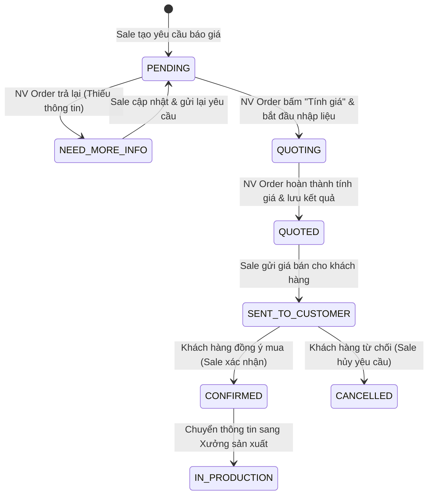
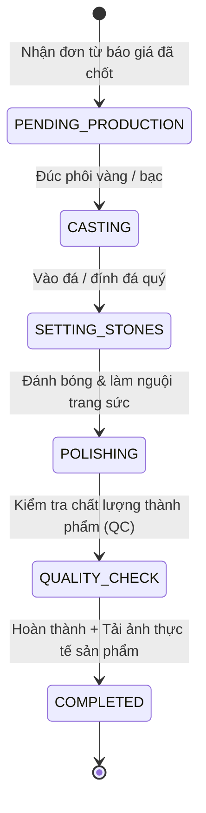

# 💍 VCB Jewelry Pricing & Production Management Tool

Hệ thống quản lý yêu cầu báo giá gia công trang sức luxury và theo dõi tiến độ sản xuất thời gian thực dành cho **VCB Jewelry**. Dự án tích hợp các công cụ tính giá tự động phức tạp, bảo mật cơ cấu giá vốn theo vai trò người dùng (Data Masking) và thông báo đẩy thời gian thực (SSE).

---

## 📂 Cấu trúc thư mục dự án

```
Jewelry-Pricing-Tool/
├── Jewelry-Pricing-Tool-BE-2/   # Express.js Backend (Chạy tại cổng 3000)
└── Jewelry-Pricing-Tool-FE/     # Next.js Frontend (Chạy tại cổng 3001)
```

---

## ⚙️ Sơ đồ cổng kết nối & Luồng dữ liệu

```
                  ┌──────────────────────────────┐
                  │      Next.js Frontend        │
                  │   http://localhost:3001      │
                  └──────────────┬───────────────┘
                                 │
                 HTTP Requests   │  SSE Notifications
                 & File Uploads  │  (Real-time Streams)
                                 ▼
                  ┌──────────────────────────────┐
                  │     Express.js Backend       │
                  │   http://localhost:3000      │
                  └──────────────┬───────────────┘
                                 │
                                 ▼ 
                  ┌──────────────────────────────┐
                  │         MongoDB              │
                  │  mongodb://localhost:27017   │
                  └──────────────────────────────┘
```

---

## 🔄 Quy trình nghiệp vụ hệ thống (Business Workflow)

Quy trình hoạt động được chia làm 2 giai đoạn chính liên kết chặt chẽ qua cơ chế chuyển đổi trạng thái tự động:

### 1. Luồng Báo Giá Trang Sức (Quotation Workflow)


### 2. Luồng Sản Xuất Gia Công (Production Workflow)
Sau khi Báo giá chuyển sang trạng thái `CONFIRMED`, hệ thống tự động tạo một Đơn sản xuất mới tại Xưởng:


---

## 👥 Hệ thống Vai trò & Bảo mật Dữ liệu (Roles & Data Masking)

Hệ thống phân quyền chi tiết cho 4 bộ phận để tối ưu hóa quy trình vận hành và bảo vệ bí mật kinh doanh:

| Vai trò (Role) | Màn hình truy cập | Quyền hạn chính |
| :--- | :--- | :--- |
| **sale** | Dashboard, Báo giá | Tạo yêu cầu báo giá, chỉnh sửa khi bị trả về, gửi giá cho khách, Xác nhận Chốt/Hủy đơn. |
| **order** (Pricer) | Dashboard, Báo giá, Calculator, Cài đặt | Tính toán chi tiết trọng lượng vàng, tiền công, chọn đá và cấu hình giá bán. |
| **workshop** (Xưởng) | Dashboard, Sản xuất | Tiếp nhận đơn hàng sản xuất, cập nhật từng trạng thái gia công, tải lên ảnh sản phẩm hoàn thiện. |
| **admin** | Toàn bộ chức năng | Quản trị người dùng, cấu hình tỷ giá vàng 24K, hệ số bạc, các bậc lợi nhuận kinh doanh. |

### 🔒 Chính sách bảo mật ẩn giá vốn (Data Masking)
Để bảo vệ biên lợi nhuận và giá nhập nguyên liệu của doanh nghiệp:
* **Nhân viên Sale** chỉ nhìn thấy **Giá bán lẻ đề xuất (Suggested Selling Price)** cuối cùng trên mọi giao diện và file xuất PDF.
* Tất cả chi tiết về giá trị cốt lõi như: *trọng lượng vàng chi tiết, giá nguyên liệu vàng 24K, đơn giá/loại đá quý, tiền công chế tác, giá vốn trước VAT, thuế VAT và biên lợi nhuận áp dụng* **hoàn toàn bị ẩn** đối với tài khoản Sale. Chỉ tài khoản **Order (Pricer)** và **Admin** mới có quyền xem các trường thông tin nhạy cảm này.

---

## 📐 Công thức toán học tính giá trang sức (Pricing Formulas)

Dự án áp dụng cơ chế định giá chính xác theo tiêu chuẩn ngành kim hoàn:

### 1. Định giá Trang sức Vàng (Gold Pricing)

Giá bán lẻ trang sức vàng được tính toán qua 5 bước liên tiếp:

#### Bước 1: Tính giá vàng nguyên liệu theo tuổi
$$\text{Giá vàng theo tuổi} = \text{Tỉ lệ tuổi vàng áp dụng (Applied Ratio)} \times \text{Giá vàng 24K nguyên liệu (VND/Chỉ)} \times \text{Trọng lượng (Chỉ)}$$
* *Lưu ý*: Trọng lượng quy đổi $1\text{ chỉ} = 3.75\text{g}$. Tỷ lệ áp dụng đã bao gồm phụ phí hao hụt chế tác hao phí (hao hụt vàng trong lúc mài, đúc).

#### Bước 2: Tính tổng giá vốn trước VAT
$$\text{Giá vốn trước VAT} = \text{Giá vàng theo tuổi} + \text{Tiền công chế tác} + \text{Tổng tiền đá quý}$$

#### Bước 3: Tính giá vốn có VAT (Thuế giá trị gia tăng 10%)
$$\text{Giá vốn có VAT} = \text{Giá vốn trước VAT} \times 1.1$$

#### Bước 4: Áp dụng biên lợi nhuận động theo bậc giá vốn
Hệ thống tự động xác định **Hệ số chia (Divisor)** dựa trên giá vốn có VAT để tối ưu giá bán lẻ:
$$\text{Giá bán đề xuất} = \frac{\text{Giá vốn có VAT}}{\text{Hệ số chia (Divisor)}}$$

Bảng phân bậc lợi nhuận mặc định được cấu hình trong hệ thống:
| Bậc giá vốn có VAT | Hệ số chia (Divisor) | Biên lợi nhuận mục tiêu |
| :--- | :--- | :--- |
| Dưới 5,000,000 VND | **0.65** | 35% |
| Từ 5,000,000 đến dưới 10,000,000 VND | **0.68** | 32% |
| Từ 10,000,000 đến dưới 20,000,000 VND | **0.70** | 30% |
| Từ 20,000,000 đến dưới 50,000,000 VND | **0.72** | 28% |
| Từ 50,000,000 VND trở lên | **0.75** | 25% |

#### Bước 5: Làm tròn số
Giá bán đề xuất sau cùng được làm tròn đến hàng nghìn đồng gần nhất để thuận tiện cho giao dịch thương mại.

---

### 2. Định giá Trang sức Bạc (Silver Pricing)
Sản phẩm bạc được định giá đơn giản thông qua hệ số nhân nhân bán lẻ:
$$\text{Giá bán đề xuất} = \text{Giá vốn} \times \text{Silver Multiplier}$$
* *Hệ số nhân bạc (Silver Multiplier)* mặc định là **3** (được tải cấu hình động từ database).

---

### 3. Công cụ tính tiền đá quý (Stone Calculator)
Tiền đá được tính toán linh hoạt bằng bảng tính đá chuyên dụng hỗ trợ 5 nhóm đá chính: **Kim cương Lab, Kim cương thiên nhiên, Đá Moissanite, Đá CZ, Đá màu/phụ kiện**.
Hỗ trợ 2 phương pháp tính:
* **Tính theo viên (Per piece)**:
  $$\text{Tiền đá} = \text{Số lượng} \times \text{Đơn giá mỗi viên}$$
* **Tính theo trọng lượng Carat (Per carat)**:
  $$\text{Tiền đá} = \text{Số lượng} \times \text{Trọng lượng mỗi viên (ct)} \times \text{Đơn giá mỗi Carat}$$

---

## ⚡ Hướng dẫn cài đặt & Khởi chạy dự án

### Yêu cầu hệ thống
* **Node.js**: Phiên bản 18 hoặc 20 trở lên
* **MongoDB**: MongoDB Server chạy cục bộ tại `mongodb://localhost:27017` hoặc tài khoản MongoDB Atlas Cloud.

---

### 1. Khởi chạy Backend (Express.js)

1. Di chuyển vào thư mục backend mới:
   ```bash
   cd Jewelry-Pricing-Tool-BE-2
   ```
2. Cài đặt các gói phụ thuộc (dependencies):
   ```bash
   npm install
   ```
3. Thiết lập biến môi trường:
   Sao chép tệp mẫu cấu hình sang tệp chính thức:
   ```bash
   cp .env.example .env
   ```
   Mở tệp `.env` vừa tạo và chỉnh sửa cấu hình phù hợp:
   ```env
   MONGODB_URI=mongodb://localhost:27017/Jewelry-Pricing-Tool
   PORT=3000
   FE_URL=http://localhost:3001
   ```
4. **Seed dữ liệu mẫu ban đầu (Quan trọng)**:
   Để hệ thống tự động chèn các cấu hình ban đầu về tỷ lệ vàng, danh sách đơn giá đá mẫu, biên lợi nhuận và giá vàng 24K ngày hôm nay vào database, chạy lệnh seed:
   ```bash
   npm run seed
   ```
5. Khởi chạy server ở chế độ phát triển (development mode với nodemon & ts-node):
   ```bash
   npm run dev
   ```
   *Backend sẽ lắng nghe tại:* `http://localhost:3000`

---

### 2. Khởi chạy Frontend (Next.js)

1. Di chuyển vào thư mục frontend:
   ```bash
   cd Jewelry-Pricing-Tool-FE
   ```
2. Cài đặt các gói phụ thuộc:
   ```bash
   npm install
   ```
3. Thiết lập biến môi trường:
   Sao chép tệp mẫu:
   ```bash
   cp .env.local.example .env.local
   ```
   Kiểm tra tệp `.env.local` để đảm bảo API trỏ đúng về cổng của backend:
   ```env
   NEXT_PUBLIC_API_URL=http://localhost:3000
   ```
4. Khởi chạy server Next.js ở chế độ phát triển:
   ```bash
   npm run dev
   ```
   *Frontend sẽ hoạt động tại:* `http://localhost:3001`

---

## 🔔 Luồng thông báo thời gian thực (Real-time Notification Flow)

Hệ thống tích hợp **SSE (Server-Sent Events)** để đẩy thông báo thời gian thực trực tiếp lên trình duyệt của nhân viên mà không cần tải lại trang (No Polling):

1. **Sale cập nhật thông tin** $\rightarrow$ Hệ thống tự động đẩy thông báo dạng Toast tới toàn bộ nhân viên **Order (Pricer)** để họ biết yêu cầu đã sẵn sàng để tính giá.
2. **Order hoàn thành báo giá** $\rightarrow$ Đẩy thông báo tức thì tới nhân viên **Sale** phụ trách đơn hàng để gửi ngay cho khách hàng kèm theo giá bán lẻ đề xuất.
3. **Order từ chối yêu cầu** $\rightarrow$ Gửi thông báo kèm **Lý do từ chối (Reject Reason)** trực tiếp tới Sale để họ sửa đổi dữ liệu nhanh chóng.
4. **Sale xác nhận đặt hàng / hủy đơn** $\rightarrow$ Gửi thông báo tới bộ phận **Order** để ghi nhận tiền cọc hoặc cập nhật lịch sử.
