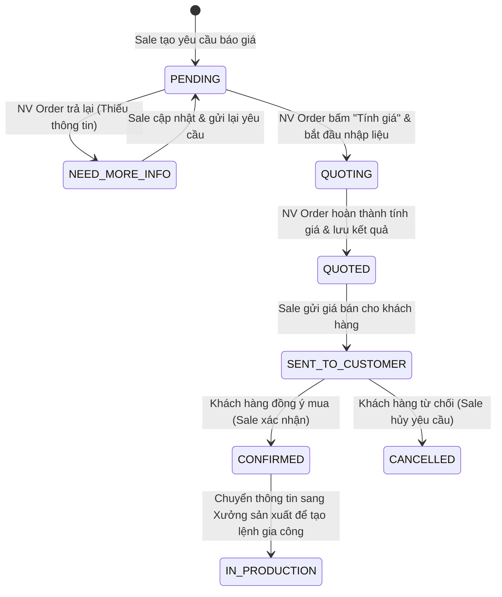
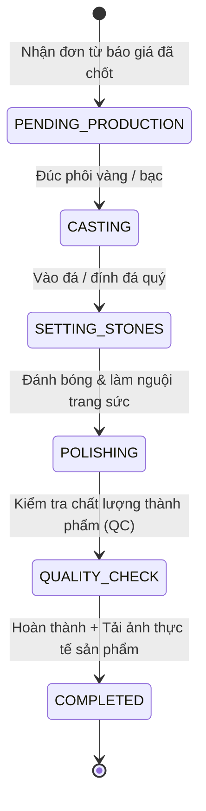

# 💍 VCB Jewelry Pricing & Production Management Tool

Hệ thống quản lý yêu cầu báo giá gia công trang sức luxury và theo dõi tiến độ sản xuất thời gian thực dành cho **VCB Jewelry**. Dự án tích hợp các công cụ tính giá tự động phức tạp, bảo mật cơ cấu giá vốn theo vai trò người dùng (Data Masking) và thông báo đẩy thời gian thực thông qua Server-Sent Events (SSE).

Dự án được phát triển và vận hành dựa trên hai thư mục chính:
*   **`Jewelry-Pricing-Tool-BE-2`**: Express.js Backend sử dụng TypeScript và Mongoose (chạy tại cổng 3000).
*   **`Jewelry-Pricing-Tool-FE`**: Next.js Frontend sử dụng App Router, Tailwind CSS, và Framer Motion (chạy tại cổng 3001).

---

## ⚙️ Sơ đồ cổng kết nối & Luồng dữ liệu

```
                  ┌──────────────────────────────┐
                  │      Next.js Frontend        │
                  │   http://localhost:3001      │
                  └──────────────┬───────────────┘
                                 │
                 HTTP Requests   │  SSE Notifications
                 & File Uploads  │  (Real-time Streams)
                                 ▼
                  ┌──────────────────────────────┐
                  │     Express.js Backend       │
                  │   http://localhost:3000      │
                  └──────────────┬───────────────┘
                                 │
                                 ▼ 
                  ┌──────────────────────────────┐
                  │         MongoDB              │
                  │  mongodb://localhost:27017   │
                  └──────────────────────────────┘
```

---

## 📂 Cấu trúc chi tiết & Vai trò các tệp tin (Project Architecture)

Để dễ dàng quản lý và phát triển, mã nguồn được tổ chức phân lớp rõ ràng cho cả Frontend (Next.js) và Backend (Express.js):

### 1. Express.js Backend (`Jewelry-Pricing-Tool-BE-2`)
Backend đảm nhận nhiệm vụ lưu trữ cơ sở dữ liệu, quản lý kết nối thời gian thực và cung cấp API RESTful.

*   **[package.json](file:///c:/Jewelry-Pricing-Tool/Jewelry-Pricing-Tool-BE-2/package.json)**: Khai báo các thư viện phụ thuộc (Express, Mongoose, RxJS, Multer) và các lệnh chạy dự án (`dev` chạy nodemon, `seed` nạp cơ sở dữ liệu mẫu).
*   **[tsconfig.json](file:///c:/Jewelry-Pricing-Tool/Jewelry-Pricing-Tool-BE-2/tsconfig.json)**: Cấu hình trình biên dịch TypeScript cho Backend.
*   **[nodemon.json](file:///c:/Jewelry-Pricing-Tool/Jewelry-Pricing-Tool-BE-2/nodemon.json)**: Cấu hình tự động khởi động lại server khi phát hiện thay đổi trong mã nguồn.
*   **`src/config/db.ts`**: Thiết lập kết nối MongoDB và tự động nạp cấu hình tính giá mẫu ban đầu nếu cơ sở dữ liệu trống.
*   **`src/models/`** (Lớp thực thể dữ liệu):
    *   [Quote.ts](file:///c:/Jewelry-Pricing-Tool/Jewelry-Pricing-Tool-BE-2/src/models/Quote.ts): Định nghĩa Schema và trạng thái của yêu cầu báo giá.
    *   [Production.ts](file:///c:/Jewelry-Pricing-Tool/Jewelry-Pricing-Tool-BE-2/src/models/Production.ts): Định nghĩa Schema lệnh sản xuất gia công tại xưởng, gán thợ và lưu trữ ảnh thành phẩm.
    *   [PricingConfig.ts](file:///c:/Jewelry-Pricing-Tool/Jewelry-Pricing-Tool-BE-2/src/models/PricingConfig.ts): Lưu hệ số chia bậc lợi nhuận, giá vàng 24K hôm nay và hệ số nhân bạc.
    *   [GoldPrice.ts](file:///c:/Jewelry-Pricing-Tool/Jewelry-Pricing-Tool-BE-2/src/models/GoldPrice.ts) / [StonePrice.ts](file:///c:/Jewelry-Pricing-Tool/Jewelry-Pricing-Tool-BE-2/src/models/StonePrice.ts) / [MaterialRatio.ts](file:///c:/Jewelry-Pricing-Tool/Jewelry-Pricing-Tool-BE-2/src/models/MaterialRatio.ts): Lưu lịch sử giá vàng nguyên liệu, đơn giá các loại đá quý và tỷ giá quy đổi tuổi vàng.
    *   [QuotationHistory.ts](file:///c:/Jewelry-Pricing-Tool/Jewelry-Pricing-Tool-BE-2/src/models/QuotationHistory.ts): Nhật ký ghi nhận lịch sử thay đổi trạng thái của đơn hàng.
*   **`src/routes/`** (Tầng định tuyến Endpoint):
    *   [index.ts](file:///c:/Jewelry-Pricing-Tool/Jewelry-Pricing-Tool-BE-2/src/routes/index.ts): Gom toàn bộ các route con và định cấu hình tiền tố endpoint (`/quotes`, `/production`, `/pricing-config`, `/notifications`).
    *   `quotes.routes.ts` / `production.routes.ts` / `pricingConfig.routes.ts` / `notifications.routes.ts`: Định tuyến chi tiết cho từng phân hệ nghiệp vụ.
*   **`src/controllers/`** (Điều phối HTTP Request/Response):
    *   `quotes.controller.ts` / `production.controller.ts` / `pricingConfig.controller.ts`: Tiếp nhận HTTP Request, gọi tầng Service xử lý và trả về JSON Response cho client.
    *   `notifications.controller.ts`: Quản lý kết nối Server-Sent Events (SSE) mở/đóng luồng đẩy thông báo thời gian thực tới Client.
*   **`src/services/`** (Tầng logic nghiệp vụ lõi):
    *   `quotes.service.ts`: Xử lý tạo mã báo giá `QT-xxxx`, tính toán lại giá bán, cập nhật thông tin và cập nhật trạng thái đơn báo giá.
    *   `production.service.ts`: Tạo lệnh gia công `PO-xxxx`, quản lý tiến độ sản xuất và cập nhật ảnh hoàn thiện sản phẩm từ xưởng.
    *   `pricingConfig.service.ts`: Truy vấn và cập nhật các định mức biên lợi nhuận, đơn giá vàng.
    *   `notifications.service.ts`: Event Bus trung tâm sử dụng **RxJS Subject** chịu trách nhiệm lọc và phát thông báo thời gian thực theo vai trò người nhận.
*   **`src/middleware/upload.middleware.ts`**: Quản lý upload file bằng Multer (lưu ảnh vào thư mục `uploads/quotes` và `uploads/production`).
*   **`src/app.ts`** & **`src/server.ts`**: Khởi tạo Express App, thiết lập CORS, xử lý lỗi tập trung và lắng nghe cổng kết nối.
*   **`src/seed.ts`**: Script độc lập để khởi tạo nhanh bộ dữ liệu định mức ban đầu cho database (`npm run seed`).

### 2. Next.js Frontend (`Jewelry-Pricing-Tool-FE`)
Frontend Next.js cung cấp giao diện người dùng tương tác thời gian thực, thực thi các thuật toán tính giá bán lẻ và bảo mật ẩn thông tin giá vốn theo vai trò.

*   **[package.json](file:///c:/Jewelry-Pricing-Tool/Jewelry-Pricing-Tool-FE/package.json)**: Khai báo các dependencies của giao diện (React 19, Next.js 15, Framer Motion, Radix UI, Recharts để vẽ biểu đồ, Lucide-React cho icon).
*   **[components.json](file:///c:/Jewelry-Pricing-Tool/Jewelry-Pricing-Tool-FE/components.json)**: Cấu hình tích hợp của bộ giao diện Shadcn UI.
*   **`app/`** (Cấu trúc App Router):
    *   [layout.tsx](file:///c:/Jewelry-Pricing-Tool/Jewelry-Pricing-Tool-FE/app/layout.tsx): Khung giao diện chung của toàn bộ trang web và tích hợp Notifications Provider.
    *   [page.tsx](file:///c:/Jewelry-Pricing-Tool/Jewelry-Pricing-Tool-FE/app/page.tsx): Dashboard trung tâm hiển thị các thành phần màn hình dựa trên vai trò hiện tại (Sale, Order, Admin) và điều phối các tabs chức năng.
    *   [globals.css](file:///c:/Jewelry-Pricing-Tool/Jewelry-Pricing-Tool-FE/app/globals.css): Khai báo thư viện Tailwind CSS và định nghĩa các lớp hiệu ứng đặc biệt (shimmer, noise nền, gradient màu vàng luxury).
*   **`components/`** (Các thành phần UI & Nghiệp vụ):
    *   [header.tsx](file:///c:/Jewelry-Pricing-Tool/Jewelry-Pricing-Tool-FE/components/header.tsx): Thanh điều hướng, bộ chuyển đổi vai trò (Role Switcher) nhanh và danh sách thông báo đẩy nhận qua SSE.
    *   [quote-request-modal.tsx](file:///c:/Jewelry-Pricing-Tool/Jewelry-Pricing-Tool-FE/components/quote-request-modal.tsx): Form dành cho **Sale** tạo yêu cầu báo giá mới kèm upload tối đa 5 hình ảnh thiết kế.
    *   [sale-dashboard.tsx](file:///c:/Jewelry-Pricing-Tool/Jewelry-Pricing-Tool-FE/components/sale-dashboard.tsx): Giao diện quản lý danh sách báo giá của bộ phận Sale dưới dạng lưới thẻ sản phẩm.
    *   [quote-list-pricer.tsx](file:///c:/Jewelry-Pricing-Tool/Jewelry-Pricing-Tool-FE/components/quote-list-pricer.tsx): Giao diện trung tâm của bộ phận **Order**, cho phép duyệt danh sách, từ chối yêu cầu, nhập liệu tính toán giá chi tiết.
    *   [gold-calculator.tsx](file:///c:/Jewelry-Pricing-Tool/Jewelry-Pricing-Tool-FE/components/gold-calculator.tsx) / [silver-calculator.tsx](file:///c:/Jewelry-Pricing-Tool/Jewelry-Pricing-Tool-FE/components/silver-calculator.tsx) / [stone-calculator.tsx](file:///c:/Jewelry-Pricing-Tool/Jewelry-Pricing-Tool-FE/components/stone-calculator.tsx): Bảng tính toán giá nhanh chi tiết độc lập.
    *   [workflow-status.tsx](file:///c:/Jewelry-Pricing-Tool/Jewelry-Pricing-Tool-FE/components/workflow-status.tsx): Biểu thanh trạng thái (stepper) thể hiện tiến trình hiện tại của báo giá.
    *   [production-board.tsx](file:///c:/Jewelry-Pricing-Tool/Jewelry-Pricing-Tool-FE/components/production-board.tsx): Bảng Kanban quản lý xưởng sản xuất, hỗ trợ kéo thả trạng thái gia công và tải ảnh thành phẩm khi hoàn thành.
*   **`lib/`** (Thư viện tiện ích và gọi API):
    *   [api.ts](file:///c:/Jewelry-Pricing-Tool/Jewelry-Pricing-Tool-FE/lib/api.ts): Client gọi API cấu hình sẵn các hàm tương tác với Backend.
    *   [pricing.ts](file:///c:/Jewelry-Pricing-Tool/Jewelry-Pricing-Tool-FE/lib/pricing.ts): **Lõi tính giá của toàn bộ hệ thống**. Thực hiện công thức tính giá vàng tuổi, giá đá quý, VAT 10% và áp dụng hệ số chia bậc lợi nhuận động.
    *   [use-sse-notifications.ts](file:///c:/Jewelry-Pricing-Tool/Jewelry-Pricing-Tool-FE/lib/use-sse-notifications.ts): Custom hook kết nối và lắng nghe EventStream từ API SSE của backend.
    *   [notifications.tsx](file:///c:/Jewelry-Pricing-Tool/Jewelry-Pricing-Tool-FE/lib/notifications.tsx): Context quản lý lưu trữ trạng thái hiển thị thông báo toast và danh sách thông báo.
    *   [types.ts](file:///c:/Jewelry-Pricing-Tool/Jewelry-Pricing-Tool-FE/lib/types.ts): Định nghĩa toàn bộ kiểu dữ liệu TypeScript dùng chung trên Frontend.

---

## 🔄 Quy trình nghiệp vụ hệ thống (Business Workflow)

Quy trình hoạt động được chia làm 2 giai đoạn chính liên kết chặt chẽ qua cơ chế chuyển đổi trạng thái tự động:

### 1. Luồng Báo Giá Trang Sức (Quotation Workflow)


### 2. Luồng Sản Xuất Gia Công (Production Workflow)
Sau khi Báo giá chuyển sang trạng thái `CONFIRMED`, hệ thống tạo một Đơn sản xuất mới tại Xưởng:


---

## 👥 Hệ thống Vai trò & Bảo mật Dữ liệu (Roles & Data Masking)

Hệ thống phân quyền chi tiết cho các bộ phận để tối ưu hóa quy trình vận hành và bảo vệ bí mật kinh doanh:

### 1. Vai trò người dùng (Roles)
*   **Sale (Nhân viên bán hàng)**: Tạo yêu cầu báo giá, nhận thông tin giá phản hồi, gửi giá cho khách hàng và cập nhật kết quả giao dịch.
*   **Order (Báo giá viên & Quản trị)**: Toàn quyền truy cập và tính toán chi tiết giá vốn sản phẩm, thay đổi tỷ giá vàng nguyên liệu, định mức công và theo dõi thợ gia công ở xưởng.
*   **Admin**: Quản trị người dùng, cấu hình tỷ giá vàng 24K, hệ số bạc, các bậc lợi nhuận kinh doanh.

### 2. Chính sách bảo mật ẩn giá vốn (Data Masking)
Để bảo vệ biên lợi nhuận của doanh nghiệp và bảo mật giá nhập nguyên liệu:
*   **Nhân viên Sale** chỉ nhìn thấy **Giá bán lẻ đề xuất (Suggested Selling Price)** cuối cùng trên mọi giao diện và file xuất PDF.
*   Tất cả chi tiết về giá trị cốt lõi như: *trọng lượng vàng chi tiết, giá nguyên liệu vàng 24K, đơn giá/loại đá quý, tiền công chế tác, giá vốn trước VAT, thuế VAT và biên lợi nhuận áp dụng* **hoàn toàn bị ẩn** đối với tài khoản Sale. Chỉ tài khoản **Order / Admin** mới có quyền xem các trường thông tin nhạy cảm này.

---

## 📐 Công thức toán học tính giá trang sức (Pricing Formulas)

### 1. Định giá Trang sức Vàng (Gold Pricing)

Giá bán lẻ trang sức vàng được tính toán qua 5 bước liên tiếp:

#### Bước 1: Tính giá vàng nguyên liệu theo tuổi
$$\text{Giá vàng theo tuổi} = \text{Tỉ lệ tuổi vàng áp dụng (Applied Ratio)} \times \text{Giá vàng 24K nguyên liệu (VND/Chỉ)} \times \text{Trọng lượng (Chỉ)}$$
*   *Lưu ý*: Trọng lượng quy đổi $1\text{ chỉ} = 3.75\text{g}$. Tỷ lệ áp dụng đã bao gồm phụ phí hao hụt chế tác hao phí (hao hụt vàng trong lúc mài, đúc).

#### Bước 2: Tính tổng giá vốn trước VAT
$$\text{Giá vốn trước VAT} = \text{Giá vàng theo tuổi} + \text{Tiền công chế tác} + \text{Tổng tiền đá quý}$$

#### Bước 3: Tính giá vốn có VAT (Thuế giá trị gia tăng 10%)
$$\text{Giá vốn có VAT} = \text{Giá vốn trước VAT} \times 1.1$$

#### Bước 4: Áp dụng biên lợi nhuận động theo bậc giá vốn
Hệ thống tự động xác định **Hệ số chia (Divisor)** dựa trên giá vốn có VAT để tối ưu giá bán lẻ:
$$\text{Giá bán đề xuất} = \frac{\text{Giá vốn có VAT}}{\text{Hệ số chia (Divisor)}}$$

Bảng phân bậc lợi nhuận mặc định được cấu hình trong hệ thống:
| Bậc giá vốn có VAT | Hệ số chia (Divisor) | Biên lợi nhuận mục tiêu |
| :--- | :--- | :--- |
| Dưới 5,000,000 VND | **0.65** | 35% |
| Từ 5,000,000 đến dưới 10,000,000 VND | **0.68** | 32% |
| Từ 10,000,000 đến dưới 20,000,000 VND | **0.70** | 30% |
| Từ 20,000,000 đến dưới 50,000,000 VND | **0.72** | 28% |
| Từ 50,000,000 VND trở lên | **0.75** | 25% |

#### Bước 5: Làm tròn số
Giá bán đề xuất sau cùng được làm tròn tới hàng nghìn đồng gần nhất (ví dụ: 12.354.200đ -> 12.354.000đ) để thuận tiện cho giao dịch thương mại.

---

### 2. Định giá Trang sức Bạc (Silver Pricing)
Sản phẩm bạc được định giá đơn giản thông qua hệ số nhân bán lẻ:
$$\text{Giá bán đề xuất} = \text{Giá vốn} \times \text{Silver Multiplier}$$
*   *Silver Multiplier* (Hệ số nhân bạc) mặc định là **3** (được tải cấu hình động từ database).

---

### 3. Công cụ tính tiền đá quý (Stone Calculator)
Tiền đá được tính toán linh hoạt bằng bảng tính đá chuyên dụng hỗ trợ 5 nhóm đá chính: **Kim cương Lab, Kim cương thiên nhiên, Đá Moissanite, Đá CZ, Đá màu/phụ kiện**.
Hỗ trợ 2 phương pháp tính:
*   **Tính theo viên (Per piece)**:
    $$\text{Tổng tiền đá} = \text{Số lượng} \times \text{Đơn giá mỗi viên}$$
*   **Tính theo trọng lượng Carat (Per carat)**:
    $$\text{Tổng tiền đá} = \text{Số lượng} \times \text{Trọng lượng mỗi viên (ct)} \times \text{Đơn giá mỗi Carat}$$

---

## ⚡ Hướng dẫn cài đặt & Khởi chạy dự án

### Yêu cầu hệ thống
*   **Node.js**: Phiên bản 18 hoặc 20 trở lên.
*   **MongoDB**: MongoDB Server chạy cục bộ tại `mongodb://localhost:27017` hoặc tài khoản MongoDB Atlas Cloud.

---

### 1. Khởi chạy Backend (Express.js)

1.  Di chuyển vào thư mục backend:
    ```bash
    cd Jewelry-Pricing-Tool-BE-2
    ```
2.  Cài đặt các gói phụ thuộc (dependencies):
    ```bash
    npm install
    ```
3.  Thiết lập biến môi trường:
    Sao chép tệp mẫu cấu hình sang tệp chính thức:
    ```bash
    cp .env.example .env
    ```
    Mở tệp `.env` vừa tạo và chỉnh sửa cấu hình phù hợp:
    ```env
    MONGODB_URI=mongodb://localhost:27017/Jewelry-Pricing-Tool
    PORT=3000
    FE_URL=http://localhost:3001
    ```
4.  **Seed dữ liệu mẫu ban đầu (Quan trọng)**:
    Để hệ thống tự động chèn các cấu hình ban đầu về tỷ lệ vàng, danh sách đơn giá đá mẫu, biên lợi nhuận và giá vàng 24K ngày hôm nay vào database, chạy lệnh seed:
    ```bash
    npm run seed
    ```
5.  Khởi chạy server ở chế độ phát triển (development mode với nodemon & ts-node):
    ```bash
    npm run dev
    ```
    *Backend sẽ hoạt động tại:* `http://localhost:3000`

---

### 2. Khởi chạy Frontend (Next.js)

1.  Di chuyển vào thư mục frontend:
    ```bash
    cd Jewelry-Pricing-Tool-FE
    ```
2.  Cài đặt các gói phụ thuộc:
    ```bash
    npm install
    ```
3.  Thiết lập biến môi trường:
    Sao chép tệp mẫu:
    ```bash
    cp .env.local.example .env.local
    ```
    Kiểm tra tệp `.env.local` để đảm bảo API trỏ đúng về cổng của backend:
    ```env
    NEXT_PUBLIC_API_URL=http://localhost:3000
    ```
4.  Khởi chạy server Next.js ở chế độ phát triển:
    ```bash
    npm run dev
    ```
    *Frontend sẽ hoạt động tại:* `http://localhost:3001`
